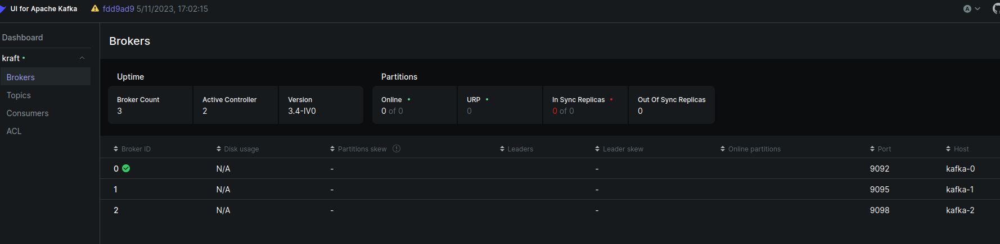

## Установка и запуск Kafka кластера с использованием Kraft

1. Как развернуть Kafka-кластер.

```
docker compose up -d
```

2. Как проверить, что кластер работает.
```
docker compose ps
```

3. Какие параметры конфигурации вы использовали и что они означают.

Всё по дефолту

4. Как проверить работу Kafka через Kafka UI.

Во вкладке Brokers будут видны все 3 брокера


5. Остановка и удаление контейнеров

```
docker compose down && echo y | docker compose rm
```

Теперь по адресу http://localhost:8080 у вас доступен интерфейс для управления Kafka.
